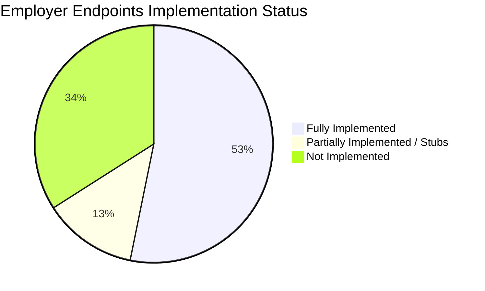
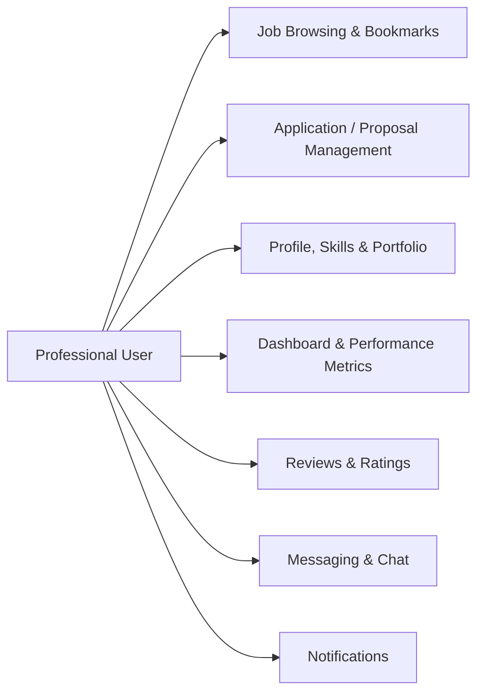
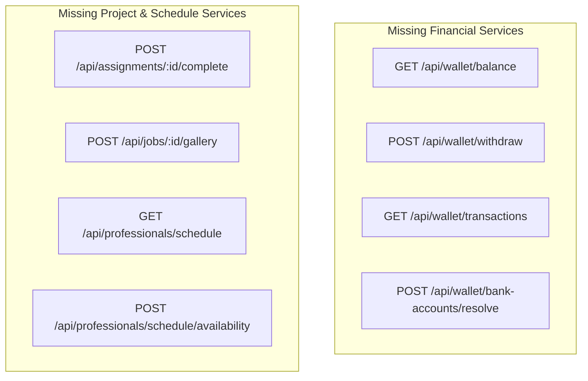

# Current API Implementation Status: Employer & Professional Portals

> **Target Repository**: Linkprosoft Backend API (`Linprosoft-Backend`)  
> **Target Frontend Portals**: Employer Portal & Professional Portal (`src/pages/professionals/`)  
> **Audit Date**: August 2026  
> **Audit Type**: Full Read-Only Codebase Verification (Routes, Controllers, Services, Repositories, Middleware, Auth Guards)

---

## Executive Summary

This comprehensive audit evaluates the entire Linkprosoft backend codebase against the integration requirements for both **Employer** and **Professional** user roles. Every route file, controller, service layer method, and database repository was inspected to determine readiness, architectural gaps, and route discrepancies.

### At a Glance

| Category | Total Evaluated | ✅ Fully Implemented | ⚠️ Partially Implemented / Stubs | ❌ Missing / Not Implemented |
| :--- | :---: | :---: | :---: | :---: |
| **Section 1: Employer Dashboard Endpoints (47 Items)** | 47 | 25 (53.2%) | 6 (12.8%) | 16 (34.0%) |
| **Section 2: Professional Inventory (Active in Codebase)** | 27 | 22 (81.5%) | 5 (18.5%) | — |
| **Section 3: Professional Gaps (Missing Features)** | 14 | — | — | 14 (100.0%) |
| **Section 4: Common & Administrative Routes** | 22 | 22 (100.0%) | 0 (0.0%) | 0 (0.0%) |

---

## 1. Employer Routes — Implementation Status

Below is the exhaustive audit of all 47 endpoints expected by the frontend Employer Dashboard, grouped into their respective functional categories.

---

### ✅ Fully Implemented (Employer)

The following endpoints are fully implemented with active routes, validation, controller logic, service layer, and database queries.

| # | Method | Endpoint | Controller | Service / Repository | Auth & Role Guard | Request / Response Details |
|---|---|---|---|---|---|---|
| **1** | `GET` | `/api/jobs/me` | `jobController.listMyJobs` | `jobService.listEmployerJobsService` → `jobsRepository.findJobsByEmployer` | `protect`, `authorize('employer')` | **Query**: `?page=&limit=&skillId=&location=&status=` **Res**: `{ success: true, data: { items: JobDTO[], pagination: { page, limit, total, pages } }, message: 'Employer jobs retrieved' }` |
| **3** | `POST` | `/api/jobs` | `jobController.createJob` | `jobService.createJobService` → `jobsRepository.createJob` | `protect` (maps `req.user.id` to `employer_id`) | **Req Body**: `{ title, description, skillId?, budget?, currency?, durationDays?, location?, visibility? }` **Res**: Created `JobDTO` with HTTP 201 |
| **4** | `GET` | `/api/jobs/:id` | `jobController.getJob` | `jobService.getJobService` → `jobsRepository.findJobById` | `protect`, `jobIdParamSchema` | **Params**: `:id` **Res**: `{ success: true, data: JobDTO }` |
| **5** | `PUT` | `/api/jobs/:id` | `jobController.updateJob` | `jobService.updateJobService` → `jobsRepository.updateJob` | `protect`, verifies `job.employer_id === req.user.id` | **Req Body**: `updateJobSchema` (updates allowed fields: `title`, `description`, `budget`, `currency`, `location`, `status`, etc.) |
| **6** | `DELETE` | `/api/jobs/:id` | `jobController.deleteJob` | `jobService.deleteJobService` → `jobsRepository.softDeleteJob` | `protect`, verifies `job.employer_id === req.user.id` | Sets `deleted_at = CURRENT_TIMESTAMP`. Returns `{ success: true, message: 'Job deleted' }` |
| **7** | `GET` | `/api/jobs/:id/matches` | `jobController.matchJobToProfessionalSkill` | `jobService.MatchJobsService` → `jobsRepository.findMatchesForJob` | `protect`, `jobIdParamSchema` | Matches professional profiles linked to `job.skill_id` ordered by `avg_rating DESC` |
| **13** | `POST` | `/api/payments/initiate` | `paymentsController.initiatePayment` | `PaymentsService.prototype.initiatePayment` | `protect`, `authorize('employer')` | **Req Body**: `{ assignmentId, currency? }` Verifies employer owns assignment and assignment is `accepted`. Initializes Paystack transaction. |
| **14** | `GET` | `/api/payments/:reference/verify` | `paymentsController.verifyPayment` | `PaymentsService.prototype.verifyPayment` | `protect` (caller must be payer, payee, or admin) | Queries payment by reference, checks status with Paystack |
| **17** | `GET` | `/api/payments/history/:userId` | `paymentsController.getHistory` | `PaymentsService.prototype.getHistory` | `protect` (caller must be owner or admin) | **Query**: `?page=&limit=` **Res**: Paginated payment history with totals |
| **18** | `POST` | `/api/assignments` | `assignmentController.createAssignment` | `assignmentsService.inviteProfessional` → `assignmentRepository.createAssignment` | `protect` (verifies employer owns `jobId`) | **Req Body**: `{ jobId, professionalId, acceptedBudget? }` Creates assignment with status `invited`. |
| **24** | `GET` | `/api/search/professionals` | `searchController.searchProfessionals` | `searchService.searchProfessionals` → `searchRepository.searchProfessionals` | Public | **Query**: `profession, skills, minRating, maxRating, minRate, maxRate, availabilityStatus, sortBy, page, limit` |
| **25** | `POST` | `/api/search/professionals` | `searchController.searchProfessionalsNlp` | `searchParserService.parseQuery` → `searchService.searchProfessionals` | Public | **Req Body**: `{ query, location?, rating?, budget?, page, limit }`. AI natural language parser (Groq/OpenAI with deterministic fallback). |
| **26** | `GET` | `/api/search/filters` | `searchController.getFilters` | `searchService.getFilterOptions` | Public | Returns available category, location, and rate filters |
| **27** | `GET` | `/api/search/skills` | `searchController.autocompleteSkills` | `searchService.autocompleteSkills` | Public | **Query**: `?q=&limit=`. Returns matching skills. |
| **28** | `POST` | `/api/chat/threads` | `chatController.createThread` | `chatService.createThread` | `protect` | **Req Body**: `{ participantId }`. Opens or creates thread. |
| **29** | `GET` | `/api/chat/threads` | `chatController.getThreads` | `chatService.getThreads` | `protect` | Returns list of threads with latest messages and unread counts |
| **30** | `GET` | `/api/chat/threads/:threadId/messages` | `chatController.getMessages` | `chatService.getMessages` | `protect` (membership verified) | **Query**: `?page=&limit=`. Paginated messages. |
| **31** | `POST` | `/api/chat/threads/:threadId/messages` | `chatController.sendMessage` | `chatService.sendMessage` | `protect` (membership verified) | **Req Body**: `{ content, attachmentUrl?, attachmentType? }`. Emits Socket.io event. |
| **32** | `PATCH` | `/api/chat/threads/:threadId/read` | `chatController.markThreadRead` | `chatService.markThreadRead` | `protect` | Marks unread messages in thread as read |
| **33** | `GET` | `/api/chat/users/:userId` | `chatController.getUser` | `chatService.getUser` | `protect` | Returns public contact card info for user in chat |
| **34** | `GET` | `/api/chat/contacts/approved` | `chatController.getApprovedContacts` | `chatService.getApprovedContacts` | `protect` | Returns approved direct contacts |
| **35** | `PATCH` | `/api/chat/threads/:threadId/accept` | `chatController.acceptMessageRequest` | `chatService.acceptMessageRequest` | `protect` | Accepts inbound chat request |
| **36** | `PATCH` | `/api/chat/threads/:threadId/decline` | `chatController.declineMessageRequest` | `chatService.declineMessageRequest` | `protect` | Declines inbound chat request |
| **37** | `GET` | `/api/notifications` | `notificationController.listNotifications` | `notificationService.listNotifications` | `protect` | **Query**: `?filter=unread\|all&limit=`. Returns user notifications + unread count. |
| **38** | `PATCH` | `/api/notifications/:id/read` | `notificationController.markRead` | `notificationService.markNotificationRead` | `protect` | Marks single notification as read |
| **39** | `PATCH` | `/api/notifications/mark-all-read` | `notificationController.markAllRead` | `notificationService.markAllNotificationsRead` | `protect` | Marks all notifications for user as read |
| **47** | `GET` | `/api/skills` | `skillController.getAllSkills` | `skillService.listAllSkills` | Public | **Query**: `?limit=&offset=`. Global skill directory catalog. |

---

### ⚠️ Partially Implemented / Stubs (Employer)

The following routes are registered in the backend, but contain logic discrepancies, stubbed handlers, or HTTP method mismatches with the frontend expectations:

| # | Method Expected | Backend Route | Handler Location | Issue / Gap Description |
|---|---|---|---|---|
| **19** | `GET /api/assignments` | `GET /api/assignments` | `assignmentController.listAssignments` ([assignmentController.ts:26-29](file:///c:/Users/HP/umarks/Linprosoft-Backend/src/modules/assignments/assignmentController.ts#L26-L29)) | **Stub Controller**: Returns hardcoded empty array `ApiResponseHandler.success(res, [], 'List of assignments')`. No DB query or filtering by employer/professional. |
| **20** | `GET /api/assignments/:id` | `GET /api/assignments/:id` | `assignmentController.getAssignmentById` ([assignmentController.ts:31-34](file:///c:/Users/HP/umarks/Linprosoft-Backend/src/modules/assignments/assignmentController.ts#L31-L34)) | **Stub Controller**: Returns hardcoded empty object `{}`. |
| **21** | `PUT /api/assignments/:id` | `PUT /api/assignments/:id` | `assignmentController.updateAssignment` ([assignmentController.ts:37-40](file:///c:/Users/HP/umarks/Linprosoft-Backend/src/modules/assignments/assignmentController.ts#L37-L40)) | **Stub Controller**: Returns hardcoded empty object `{}`. |
| **22** | `POST /api/assignments/:id/approve-satisfaction` | `PATCH /api/assignments/:id/approve-satisfaction` | `assignmentController.approveSatisfaction` ([assignmentController.ts:49-55](file:///c:/Users/HP/umarks/Linprosoft-Backend/src/modules/assignments/assignmentController.ts#L49-L55)) | **Method Mismatch**: Backend uses `PATCH`, frontend expects `POST`. Functional logic verifies employer ownership and marks satisfaction as `'satisfied'`. Automatic escrow release trigger is marked `TODO`. |
| **23** | `POST /api/assignments/:id/dispute-satisfaction` | `PATCH /api/assignments/:id/dispute-satisfaction` | `assignmentController.disputeSatisfaction` ([assignmentController.ts:58-64](file:///c:/Users/HP/umarks/Linprosoft-Backend/src/modules/assignments/assignmentController.ts#L58-L64)) | **Method & Payload Mismatch**: Backend uses `PATCH` (frontend expects `POST`). Payload expects `{ reason: string, notes?: string }` while frontend expects `{ reason, explanation, requestedRefundAmount }`. |
| **2** | `GET /api/jobs/my-jobs` | `GET /api/jobs/my-jobs` | `jobController.listMyAssignedJobs` ([jobRoutes.ts:10](file:///c:/Users/HP/umarks/Linprosoft-Backend/src/modules/jobs/jobRoutes.ts#L10)) | **Role / Intent Conflict**: Guarded by `authorize('professional')` and queries jobs assigned to a professional. If an employer calls `/api/jobs/my-jobs`, it returns `403 Forbidden`. Employers must use `GET /api/jobs/me`. |

---

### ❌ Not Implemented (Employer)

These routes are expected by the employer frontend dashboard but **do not exist** in the backend routing tables:

| # | Expected Method | Expected Endpoint | Functional Requirement | Recommended Backend Action |
|---|---|---|---|---|
| **8** | `GET` | `/api/employers/dashboard/metrics` | Employer stats (`earningsTotal`, `upcomingJobsCount`, `completedJobsCount`, `performancePercentage`, `totalSpent`) | Create employer metrics aggregation service querying `job_postings`, `job_assignments`, and `payments` where `payer_id = req.user.id`. |
| **9** | `GET` | `/api/professionals/dashboard/metrics` (for employers) | Does NOT support employer role. Query filters on `pp.user_id = $1` on `professional_profiles`. | Route `/api/employers/dashboard/metrics` is needed separately. |
| **10** | `GET` | `/api/professionals/performance` (for employers) | Does NOT support employer role. | Performance rating analytics exist strictly for professionals. |
| **11** | `GET` | `/api/payments/escrow/summary` | Employer's aggregate escrow overview: `{ totalHeld, activeEscrowCount, details: [...] }` | Create escrow summary query in `paymentsRepository` summing `amount` where `status = 'held_in_escrow' AND payer_id = $1`. |
| **12** | `GET` | `/api/payments/escrow/:jobId` | Per-job escrow status: `{ totalBudget, totalFunded, released, remainingBalance, fundingProgress }` | Create per-job escrow calculation endpoint linking `job_postings`, `job_assignments`, and `payments`. |
| **15** | `GET` | `/api/payments` | List user's payments without explicit `:userId` URL parameter | Provide alias redirecting to `GET /api/payments/history/:userId` with `req.user.id`. |
| **16** | `GET` | `/api/payments/:id` | Get single payment by database ID | Implement `GET /api/payments/:id` verifying `payer_id === req.user.id OR payee_id === req.user.id`. |
| **40** | `POST` | `/api/jobs/:jobId/invite` | Direct job invite shortcut (`{ professionalId, message? }`) | Can route to `assignmentService.inviteProfessional`. |
| **41** | `POST` | `/api/employers/saved-professionals` | Bookmark/save a professional for later | Create `employer_saved_professionals` table & controller. |
| **42** | `GET` | `/api/employers/saved-professionals` | List employer's bookmarked professionals | Create query joining saved IDs to `professional_profiles`. |
| **43** | `DELETE` | `/api/employers/saved-professionals/:id` | Remove a bookmarked professional | Delete row by employer ID and saved professional ID. |
| **44** | `GET` | `/api/schedules` | Employer's upcoming project milestones / appointments | Implement schedule module for employers and professionals. |
| **45** | `GET` | `/api/jobs/:id/gallery` | Progress photos/milestone attachments for a job | Create `job_attachments` / `job_gallery` table and query. |
| **46** | `POST` | `/api/jobs/:id/gallery` | Upload progress photos / deliverable media | Implement multipart file upload (Cloudinary/S3) and gallery DB record. |

---

### 🔍 Endpoint Clarifications & Ambiguities

1. **`/api/jobs/my-jobs` vs `/api/jobs/me`**:
   - In [`src/modules/jobs/jobRoutes.ts`](file:///c:/Users/HP/umarks/Linprosoft-Backend/src/modules/jobs/jobRoutes.ts#L9-L10):
     - `GET /api/jobs/me` is protected with `authorize('employer')` and queries `job_postings WHERE employer_id = $userId`.
     - `GET /api/jobs/my-jobs` is protected with `authorize('professional')` and queries `job_assignments WHERE professional_id = $profileId`.
   - **Frontend Recommendation**:
     - Employer dashboard calling `jobService.getMyEmployerJobs()` **must call `/api/jobs/me`**.
     - Professional dashboard calling `jobService.getMyJobs()` **must call `/api/jobs/my-jobs`**.

2. **Job Satisfaction Approvals & Disputes (`POST` vs `PATCH`)**:
   - Backend routes: `PATCH /api/assignments/:id/approve-satisfaction` and `PATCH /api/assignments/:id/dispute-satisfaction`.
   - Frontend expects `POST`. Either frontend should update HTTP method to `PATCH`, or backend router should accept both `POST` and `PATCH`.

3. **Dispute Payload Shape**:
   - Frontend sends: `{ reason: string, explanation: string, requestedRefundAmount: number }`.
   - Backend accepts: `{ reason: string, notes?: string }`.
   - Schema alignment is needed to persist the requested refund amount.

4. **Escrow Initiation Payload**:
   - `POST /api/payments/initiate` requires `{ assignmentId: number, currency?: string }`. The employer must have already created the assignment and the professional must have accepted it before escrow payment can be initialized.

---

## 2. Professional Routes — Full Inventory

The backend contains a suite of dedicated endpoints designed for the professional user workflow:

### ✅ Fully Implemented (Professional)

| # | Route | Controller Function | Service Layer | Auth Guard | Implementation Summary |
|---|---|---|---|---|---|
| **1** | `GET /api/jobs` | `jobController.listJobs` | `jobService.listJobsService` → `jobsRepository.listJobs` | `protect` | Public browse jobs with filters: `skillId`, `location`, `status`, `search`, `category`, `minBudget`, `maxBudget`, `minRating`, `sortBy`, pagination. |
| **2** | `GET /api/jobs/:id` | `jobController.getJob` | `jobService.getJobService` → `jobsRepository.findJobById` | `protect` | Returns single job details. |
| **3** | `POST /api/jobs/:id/bookmark` | `jobController.toggleBookmark` | `bookmarkRepository.toggleBookmark` | `protect` | Toggles bookmark for the authenticated user (`job_bookmarks` table). |
| **4** | `GET /api/jobs/my-jobs` | `jobController.listMyAssignedJobs` | `jobService.listProfessionalJobsService` → `jobsRepository.findJobsByProfessional` | `protect`, `authorize('professional')` | Returns all jobs assigned to the authenticated professional via `job_assignments`. |
| **5** | `POST /api/applications` | `applicationController.createApplication` | `applicationService.createApplication` → `applicationRepository.createApplication` | `protect` | Professional submits a bid/proposal: `{ jobId, coverLetter, bidAmount, deliveryDays? }`. |
| **6** | `GET /api/applications` | `applicationController.listApplications` | `applicationService.listApplications` → `applicationRepository.listByProfessional` | `protect` | Paginated list of submitted proposals (`?status=&page=&limit=`). |
| **7** | `GET /api/applications/metrics` | `applicationController.getMetrics` | `applicationService.getMetrics` → `applicationRepository.getMetrics` | `protect` | Application funnel metrics: total submitted, active, accepted, rejected. |
| **8** | `GET /api/applications/:id` | `applicationController.getApplication` | `applicationService.getApplication` → `applicationRepository.findById` | `protect` | Detailed proposal view including associated job info. |
| **9** | `DELETE /api/applications/:id` | `applicationController.withdrawApplication` | `applicationService.withdrawApplication` → `applicationRepository.withdraw` | `protect` | Withdraws an active proposal. |
| **10** | `GET /api/professionals/dashboard/metrics` | `professionalMetricsController.dashboardMetrics` | `professionalMetricsService.getDashboardMetrics` | `protect` | Calculates professional stats: `earningsTotal`, `upcomingJobsCount`, `completedJobsCount`, `performancePercentage`. |
| **11** | `GET /api/professionals/performance` | `professionalMetricsController.performance` | `professionalMetricsService.getPerformance` | `protect` | Performance stats: `responseRate`, `successRate`, `ratingBreakdown` (5-star to 1-star distribution), `totalCompleted` for `this_week` or `this_month`. |
| **12** | `POST /api/profiles` | `profileController.createProfile` | `profileService.createProfile` | `protect` | Creates professional profile record (`hourlyRate`, `bio`, `profession`, `availabilityStatus`). |
| **13** | `GET /api/profiles/me` | `profileController.getMyProfile` | `profileService.getProfileByUserId` | `protect` | Returns authenticated user's professional profile. |
| **14** | `PUT /api/profiles/me` | `profileController.updateProfile` | `profileService.updateProfile` | `protect` | Updates profile fields (`hourlyRate`, `bio`, `profession`, `availabilityStatus`, `responseTimeHours`). |
| **15** | `DELETE /api/profiles/me` | `profileController.deleteProfile` | `profileService.deleteProfile` | `protect` | Deletes caller's profile. |
| **16** | `GET /api/profiles/:userId` | `profileController.getProfile` | `profileService.getProfileByUserId` | Public | Public profile query. |
| **17** | `GET /api/profiles/:userId/detailed` | `profileController.getDetailedProfile` | `profileService.getDetailedProfileByUserId` | Public | Comprehensive profile view with joined skills, reviews, and portfolio. |
| **18** | `POST /api/skills/me/skills` | `skillController.addMyProfileSkill` | `skillService.addSkillToMyProfile` | `protect` | Adds catalog skill to caller's profile (`{ skillId, proficiencyLevel?, yearsOfExperience?, isPrimary? }`). |
| **19** | `PUT /api/skills/me/skills/:skillId` | `skillController.updateMyProfileSkill` | `skillService.updateMyProfileSkill` | `protect` | Updates proficiency/experience for linked skill. |
| **20** | `DELETE /api/skills/me/skills/:skillId` | `skillController.removeMyProfileSkill` | `skillService.removeMyProfileSkill` | `protect` | Unlinks skill from profile. |
| **21** | `POST /api/profiles/me/certifications` | `certificationController.createMyCertification` | `certificationService.createCertification` | `protect` | Adds certificate (`{ title, issuer, issueDate?, expiryDate?, credentialUrl? }`). |
| **22** | `PUT /api/profiles/me/certifications/:certificationId` | `certificationController.updateMyCertification` | `certificationService.updateCertification` | `protect` | Updates certificate metadata. |
| **23** | `DELETE /api/profiles/me/certifications/:certificationId` | `certificationController.deleteMyCertification` | `certificationService.deleteCertification` | `protect` | Deletes certificate. |
| **24** | `POST /api/profiles/me/portfolio` | `portfolioController.createMyPortfolioItem` | `portfolioService.createPortfolioItem` | `protect` | Adds portfolio project item (`{ title, description?, imageUrl?, linkUrl? }`). |
| **25** | `PUT /api/profiles/me/portfolio/:portfolioItemId` | `portfolioController.updateMyPortfolioItem` | `portfolioService.updatePortfolioItem` | `protect` | Updates portfolio project item. |
| **26** | `DELETE /api/profiles/me/portfolio/:portfolioItemId` | `portfolioController.deleteMyPortfolioItem` | `portfolioService.deletePortfolioItem` | `protect` | Deletes portfolio project item. |
| **27** | `GET /api/reviews/:professionalId` | `reviewsController.listReviews` | `reviewsService.listReviews` | Public | Paginated reviews list and rating breakdown. |

---

### ⚠️ Partially Implemented / Route Discrepancies (Professional)

| # | Feature / Route | Current Backend State | Issue / Gap |
|---|---|---|---|
| **1** | **Accept Job Assignment** | Function `acceptAssignment` exists in `assignmentController.ts` ([assignmentController.ts:17-23](file:///c:/Users/HP/umarks/Linprosoft-Backend/src/modules/assignments/assignmentController.ts#L17-L23)) and `assignmentsService.ts` ([assignmentsService.ts:27-34](file:///c:/Users/HP/umarks/Linprosoft-Backend/src/modules/assignments/assignmentsService.ts#L27-L34)) | **Missing Route Mounting**: The controller function is never hooked up to `assignmentRoutes.ts`. Route `POST /api/assignments/:id/accept` or `PATCH /api/assignments/:id/accept` needs to be declared on the router. |
| **2** | **Singular vs Plural Profile Path** | Mounted at `/api/profiles` (`GET /api/profiles/me`, `PUT /api/profiles/me`) | The frontend `profileService` calls `/api/profile` (singular). Route aliases are needed. |
| **3** | **Profile Media Upload** | Accepts URLs as plain strings (`imageUrl`, `credentialUrl`) | No direct file upload / Cloudinary integration service exists for avatar, cover, or certification images. |
| **4** | **Assignment Lifecycle Endpoints** | `GET/PUT/DELETE /api/assignments` return stubs | Professional cannot view all assignment contracts via `GET /api/assignments` (must rely on `GET /api/jobs/my-jobs`). |
| **5** | **Direct Review for Authenticated Professional** | Route is `GET /api/reviews/:professionalId` | No direct alias `GET /api/profile/reviews` resolving the authenticated professional's profile ID automatically. |

---

## 3. Professional Routes — Still Missing

Cross-referencing the backend against the frontend subpages in `src/pages/professionals/`:
- `OverviewSubpage`
- `BrowseJobsSubpage`
- `MyJobsSubpage`
- `ApplicationsSubpage`
- `ProjectDetailsSubpage`
- `ScheduleSubpage`
- `WalletSubpage`

The following endpoints are **missing and need to be created**:

### ❌ Not Yet Created

| Subpage | Needed Route | Expected Payload / Params | Purpose |
|---|---|---|---|
| **ProjectDetailsSubpage** | `POST /api/assignments/:id/complete` | Param: `:id`, Body: `{ notes?, deliverableUrls? }` | Allows the professional to mark an assignment as completed and submit deliverable work for employer review. |
| **ProjectDetailsSubpage** | `POST /api/assignments/:id/accept` | Param: `:id` | Mount the existing `acceptAssignment` controller to allow accepting invitations. |
| **ProjectDetailsSubpage** | `POST /api/assignments/:id/decline` | Param: `:id`, Body: `{ reason? }` | Professional declines direct job invitation. |
| **ProjectDetailsSubpage** | `GET /api/jobs/:id/gallery` | Param: `:id` | Retrieve progress gallery images/milestones for a project. |
| **ProjectDetailsSubpage** | `POST /api/jobs/:id/gallery` | Param: `:id`, `multipart/form-data` | Upload work progress pictures or milestone deliverables. |
| **WalletSubpage** | `GET /api/wallet/balance` | Auth Bearer Token | Returns professional's available balance, pending escrow balance, and lifetime earnings. |
| **WalletSubpage** | `GET /api/wallet/transactions` | Query: `?page=&limit=&type=` | Detailed ledger entries (credit, debit, commission deductions, payouts). |
| **WalletSubpage** | `POST /api/wallet/bank-accounts/resolve` | Body: `{ accountNumber, bankCode }` | Resolve account name via Paystack / Flutterwave NUBAN lookup. |
| **WalletSubpage** | `POST /api/wallet/withdraw` | Body: `{ amount, bankAccountId, transferPin? }` | Initiate payout transfer to professional's registered bank account. |
| **WalletSubpage** | `GET /api/professionals/earnings/breakdown` | Query: `?period=monthly\|weekly` | Historical chart data of earnings over time. |
| **ScheduleSubpage** | `GET /api/professionals/schedule` | Query: `?startDate=&endDate=` | Calendar appointments, assignment deadlines, and scheduled consultations. |
| **ScheduleSubpage** | `POST /api/professionals/schedule/availability` | Body: `{ weeklySlots: [...], timezone }` | Configure working hours and calendar availability. |
| **ScheduleSubpage** | `PATCH /api/professionals/availability-status` | Body: `{ status: 'available' \| 'busy' \| 'unavailable' }` | Quick toggle for instant booking and search visibility. |
| **ProfileSubpage** | `POST /api/profile/media` | `multipart/form-data` (`avatar`, `coverImage`) | Upload user profile avatar and header banner. |

---

## 4. Shared / Common Routes

These routes support both **Employer** and **Professional** roles across onboarding, user management, messaging, notifications, and search.

| Mount Path | Method | Endpoint | Handler | Role / Access | Purpose |
|---|---|---|---|---|---|
| `/api/auth` | `POST` | `/api/auth/signup` | `authController.signup` | Public | Account registration |
| `/api/auth` | `POST` | `/api/auth/verify-email` | `authController.verifyEmail` | Public | Email OTP verification |
| `/api/auth` | `POST` | `/api/auth/resend-otp` | `authController.resendOtp` | Public | Resend OTP code |
| `/api/auth` | `POST` | `/api/auth/login` | `authController.login` | Public | User authentication & JWT issuance |
| `/api/auth` | `POST` | `/api/auth/forgot-password` | `authController.forgotPassword` | Public | Trigger password reset |
| `/api/auth` | `POST` | `/api/auth/verify-reset-code` | `authController.verifyResetCode` | Public | Verify reset OTP |
| `/api/auth` | `POST` | `/api/auth/reset-password` | `authController.resetPassword` | Public | Update password |
| `/api/auth` | `POST` | `/api/auth/refresh-token` | `authController.refreshToken` | Public | Rotate JWT access token |
| `/api/auth` | `POST` | `/api/auth/logout` | `authController.logout` | `protect` | Revoke session & clear cookies |
| `/api/auth` | `GET` | `/api/auth/verify` | `authController.verify` | `protect` | Restore user session on app launch |
| `/api/auth` | `GET` | `/api/auth/me` | `authController.getMe` | `protect` | Fetch authenticated user base record |
| `/api/auth` | `PATCH` | `/api/auth/me` | `authController.updateMe` | `protect` | Update user base profile (`fullName`, `location`, `phone`) |
| `/api/auth` | `GET` | `/api/auth/google` | `authController.startGoogleOAuth` | Public | Initiate Google OAuth SSO |
| `/api/auth` | `GET` | `/api/auth/google/callback` | `authController.handleGoogleOAuthCallback` | Public | Google OAuth redirect callback |
| `/api/reviews` | `POST` | `/api/reviews` | `reviewsController.createReview` | `protect` | Leave a review for completed job |
| `/api/search` | `GET` | `/api/search/professionals` | `searchController.searchProfessionals` | Public | Filtered professional search |
| `/api/search` | `POST` | `/api/search/professionals` | `searchController.searchProfessionalsNlp` | Public | AI natural language search |
| `/api/search` | `GET` | `/api/search/filters` | `searchController.getFilters` | Public | Search filter options |
| `/api/search` | `GET` | `/api/search/skills` | `searchController.autocompleteSkills` | Public | Skill search typeahead |
| `/api/waitlist` | `POST` | `/api/waitlist` | `waitlistController.joinWaitlist` | Public | Waitlist signup |
| `/api/waitlist` | `GET` | `/api/waitlist` | `waitlistController.getWaitlist` | `protect`, `authorize('admin')` | View waitlist entries |
| `/` | `GET` | `/health` | Inline | Public | Server healthcheck |

---

## 5. Route File Map

Summary of all route definitions across the backend codebase and their mapped controllers:

| Route File | Express Mount in `app.ts` | Responsibility | Key Handlers / Controllers |
|---|---|---|---|
| [`src/modules/auth/authRoutes.ts`](file:///c:/Users/HP/umarks/Linprosoft-Backend/src/modules/auth/authRoutes.ts) | `/api/auth` | Authentication, OTP verification, Google OAuth, Session, User profile update | [`authController.ts`](file:///c:/Users/HP/umarks/Linprosoft-Backend/src/modules/auth/authController.ts) |
| [`src/modules/profile/profileRoutes.ts`](file:///c:/Users/HP/umarks/Linprosoft-Backend/src/modules/profile/profileRoutes.ts) | `/api/profiles` | Professional profile CRUD, `/me`, `/:userId/detailed` | [`profileController.ts`](file:///c:/Users/HP/umarks/Linprosoft-Backend/src/modules/profile/profileController.ts) |
| [`src/modules/skill/skillRoutes.ts`](file:///c:/Users/HP/umarks/Linprosoft-Backend/src/modules/skill/skillRoutes.ts) | `/api/skills` | Global skill catalog, `/me/skills` profile skills management | [`skillController.ts`](file:///c:/Users/HP/umarks/Linprosoft-Backend/src/modules/skill/skillController.ts) |
| [`src/modules/certification/certificationRoutes.ts`](file:///c:/Users/HP/umarks/Linprosoft-Backend/src/modules/certification/certificationRoutes.ts) | `/api/profiles` | User certification CRUD (`/me/certifications`, `/:userId/certifications`) | [`certificationController.ts`](file:///c:/Users/HP/umarks/Linprosoft-Backend/src/modules/certification/certificationController.ts) |
| [`src/modules/portfolio/portfolioRoutes.ts`](file:///c:/Users/HP/umarks/Linprosoft-Backend/src/modules/portfolio/portfolioRoutes.ts) | `/api/profiles` | Portfolio project showcase CRUD (`/me/portfolio`, `/:userId/portfolio`) | [`portfolioControllers.ts`](file:///c:/Users/HP/umarks/Linprosoft-Backend/src/modules/portfolio/portfolioControllers.ts) |
| [`src/modules/search/searchRoutes.ts`](file:///c:/Users/HP/umarks/Linprosoft-Backend/src/modules/search/searchRoutes.ts) | `/api/search` | Search professionals, AI/NLP search, autocomplete, filter options | [`searchController.ts`](file:///c:/Users/HP/umarks/Linprosoft-Backend/src/modules/search/searchController.ts) |
| [`src/modules/jobs/jobRoutes.ts`](file:///c:/Users/HP/umarks/Linprosoft-Backend/src/modules/jobs/jobRoutes.ts) | `/api/jobs` | Job postings CRUD, `/me` (employer), `/my-jobs` (professional), bookmarking, skill matching | [`jobController.ts`](file:///c:/Users/HP/umarks/Linprosoft-Backend/src/modules/jobs/jobController.ts) |
| [`src/modules/applications/applicationRoutes.ts`](file:///c:/Users/HP/umarks/Linprosoft-Backend/src/modules/applications/applicationRoutes.ts) | `/api/applications` | Job proposals/bids submission, listing, withdrawal, metrics | [`applicationController.ts`](file:///c:/Users/HP/umarks/Linprosoft-Backend/src/modules/applications/applicationController.ts) |
| [`src/modules/assignments/assignmentRoutes.ts`](file:///c:/Users/HP/umarks/Linprosoft-Backend/src/modules/assignments/assignmentRoutes.ts) | `/api/assignments` | Direct assignments/invitations, satisfaction approvals and disputes | [`assignmentController.ts`](file:///c:/Users/HP/umarks/Linprosoft-Backend/src/modules/assignments/assignmentController.ts) |
| [`src/modules/professionals/professionalMetricsRoutes.ts`](file:///c:/Users/HP/umarks/Linprosoft-Backend/src/modules/professionals/professionalMetricsRoutes.ts) | `/api/professionals` | Professional dashboard metrics & performance analytics | [`professionalMetricsController.ts`](file:///c:/Users/HP/umarks/Linprosoft-Backend/src/modules/professionals/professionalMetricsController.ts) |
| [`src/modules/payments/paymentsRoutes.ts`](file:///c:/Users/HP/umarks/Linprosoft-Backend/src/modules/payments/paymentsRoutes.ts) | `/api/payments` | Paystack payment initiation, webhook handler, verification, history | [`paymentsController.ts`](file:///c:/Users/HP/umarks/Linprosoft-Backend/src/modules/payments/paymentsController.ts) |
| [`src/modules/payments/adminPaymentsRoutes.ts`](file:///c:/Users/HP/umarks/Linprosoft-Backend/src/modules/payments/adminPaymentsRoutes.ts) | `/api/admin/payments` | Admin approval queue, dispute resolution | [`paymentsController.ts`](file:///c:/Users/HP/umarks/Linprosoft-Backend/src/modules/payments/paymentsController.ts) |
| [`src/modules/reviews/reviewsRoutes.ts`](file:///c:/Users/HP/umarks/Linprosoft-Backend/src/modules/reviews/reviewsRoutes.ts) | `/api/reviews` | Reviews submission and professional reviews retrieval | [`reviewsController.ts`](file:///c:/Users/HP/umarks/Linprosoft-Backend/src/modules/reviews/reviewsController.ts) |
| [`src/modules/notifications/notificationRoutes.ts`](file:///c:/Users/HP/umarks/Linprosoft-Backend/src/modules/notifications/notificationRoutes.ts) | `/api/notifications` | In-app notifications listing, mark read, mark all read | [`notificationController.ts`](file:///c:/Users/HP/umarks/Linprosoft-Backend/src/modules/notifications/notificationController.ts) |
| [`src/modules/chat/chatRoutes.ts`](file:///c:/Users/HP/umarks/Linprosoft-Backend/src/modules/chat/chatRoutes.ts) | `/api/chat` | Chat threads, real-time messaging, requests accept/decline, contacts directory | [`chatController.ts`](file:///c:/Users/HP/umarks/Linprosoft-Backend/src/modules/chat/chatController.ts) |
| [`src/modules/waitlist/waitlistRoutes.ts`](file:///c:/Users/HP/umarks/Linprosoft-Backend/src/modules/waitlist/waitlistRoutes.ts) | `/api/waitlist` | Public waitlist submission & admin waitlist listing | [`waitlistController.ts`](file:///c:/Users/HP/umarks/Linprosoft-Backend/src/modules/waitlist/waitlistController.ts) |

---

## 6. Actionable Implementation Checklist for Backend Team

To achieve complete parity between frontend dashboard expectations and backend API capabilities:

### Priority 1: High Impact / Blocking

1. **Mount Missing Professional Accept Assignment Route**:
   - In [`src/modules/assignments/assignmentRoutes.ts`](file:///c:/Users/HP/umarks/Linprosoft-Backend/src/modules/assignments/assignmentRoutes.ts), add `router.post('/:id/accept', protect, controller.acceptAssignment)`.
2. **Implement Employer Metrics Endpoint**:
   - Create `GET /api/employers/dashboard/metrics` calculating `{ earningsTotal, upcomingJobsCount, completedJobsCount, performancePercentage, totalSpent }` where `payer_id = req.user.id` and `employer_id = req.user.id`.
3. **Flesh Out Assignment Stub Handlers**:
   - Implement `GET /api/assignments`, `GET /api/assignments/:id`, and `PUT /api/assignments/:id` in [`src/modules/assignments/assignmentController.ts`](file:///c:/Users/HP/umarks/Linprosoft-Backend/src/modules/assignments/assignmentController.ts) with real database queries filtering by user role.
4. **Align HTTP Methods for Satisfaction Actions**:
   - Support `POST` alongside `PATCH` for `/api/assignments/:id/approve-satisfaction` and `/api/assignments/:id/dispute-satisfaction`.
   - Update dispute payload schema to include `requestedRefundAmount` and `explanation`.

### Priority 2: Financial & Escrow Capabilities

5. **Escrow Breakdown Endpoints**:
   - Implement `GET /api/payments/escrow/summary` and `GET /api/payments/escrow/:jobId`.
6. **Professional Wallet Subsystem**:
   - Implement `GET /api/wallet/balance`, `GET /api/wallet/transactions`, and `POST /api/wallet/withdraw`.
   - Implement bank account verification (`POST /api/wallet/bank-accounts/resolve`).

### Priority 3: Feature Completeness

7. **Progress Gallery**:
   - Implement `GET /api/jobs/:id/gallery` and `POST /api/jobs/:id/gallery` with image upload support.
8. **Saved Professionals (Bookmarks)**:
   - Implement `POST /api/employers/saved-professionals`, `GET /api/employers/saved-professionals`, `DELETE /api/employers/saved-professionals/:id`.
9. **Schedules & Calendar**:
   - Implement `GET /api/schedules` and professional availability management.
10. **Singular Route Aliasing**:
    - Mount `/api/profile` as an alias to `/api/profiles` for seamless frontend compatibility.
