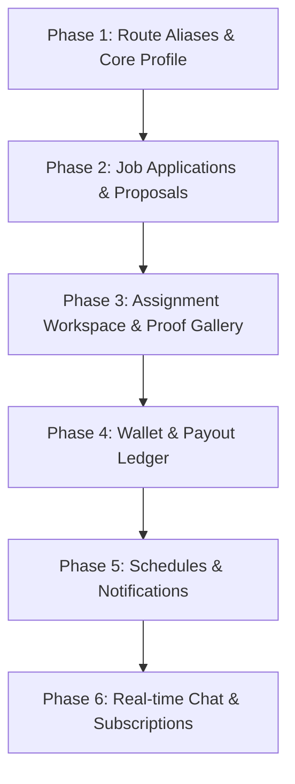

# Comprehensive Backend Route Audit: Professional Module & API Readiness

> **Target Repository**: Linkprosoft Backend API  
> **Target Frontend Module**: `src/pages/professionals/` (Linkprosoft Professional Portal)  
> **Reference Specification**: [`docs/API_INTEGRATION_OVERVIEW.md`](file:///c:/Users/HP/umarks/Linprosoft-Backend/docs/API_INTEGRATION_OVERVIEW.md)  
> **Audit Date**: August 2026  
> **Audit Status**: Complete

---

## 1. Executive Summary

This audit evaluates the current Linkprosoft backend codebase against the frontend requirements for the **Professional Portal** (`src/pages/professionals/`). The frontend comprises 10 major subpages requiring 57 distinct API endpoints spanning authentication, profiles, jobs, applications, project management, wallet/escrow, scheduling, messaging, and subscriptions.

### Readiness Scorecard

| Category | Total Required | 🟢 Ready | 🟡 Partial / Needs Adjustment | 🔴 Not Implemented | Readiness % |
| :--- | :---: | :---: | :---: | :---: | :---: |
| **1. Authentication, Profile & Portfolio** | 11 | 1 | 9 | 1 | **50.0%** (Weighted) |
| **2. Dashboard, Metrics & Notifications** | 5 | 0 | 0 | 5 | **0.0%** |
| **3. Jobs & Applications** | 9 | 2 | 2 | 5 | **33.3%** |
| **4. Project Management & Escrow** | 7 | 0 | 3 | 4 | **21.4%** |
| **5. Wallet, Escrow Payments & Withdrawals** | 10 | 0 | 0 | 10 | **0.0%** |
| **6. Schedule & Calendar** | 5 | 0 | 0 | 5 | **0.0%** |
| **7. Messaging & Real-time Chat** | 6 | 0 | 0 | 6 | **0.0%** |
| **8. Subscriptions & PRO Membership** | 4 | 0 | 0 | 4 | **0.0%** |
| **TOTALS** | **57** | **3 (5.3%)** | **14 (24.6%)** | **40 (70.1%)** | **17.5% Overall** |

*(Weighted Readiness calculated as: `(Ready * 1.0 + Partial * 0.5) / Total` = `(3*1.0 + 14*0.5) / 57` = **17.5%**)*

---

### Key Architectural Findings

1. **Route Naming Convention Discrepancy**:
   - The backend mounts profile routes at plural `/api/profiles` (e.g. `/api/profiles/me`), whereas the frontend integration contract expects singular `/api/profile` (e.g. `/api/profile`, `/api/profile/media`, `/api/profile/portfolio`).
2. **Applications / Proposals System Missing**:
   - The backend only has employer-driven direct invitations (`job_assignments` with `status = 'invited'`). There is **no database table or controller** for a professional to browse public jobs and submit a formal proposal/bid (`job_applications`).
3. **Empty Assignment Stubs**:
   - In [`src/modules/assignments/assignmentController.ts`](file:///c:/Users/HP/umarks/Linprosoft-Backend/src/modules/assignments/assignmentController.ts), endpoints `GET /api/assignments`, `GET /api/assignments/:id`, `PUT /api/assignments/:id`, and `DELETE /api/assignments/:id` currently return hardcoded empty arrays/objects.
4. **Missing Financial Subsystems (Wallet & Ledger)**:
   - The backend has direct project checkout (`POST /api/payments/initiate` via Paystack) and admin approval gates, but lacks a balance ledger, wallet accounts, withdrawal PIN authorization, NUBAN resolution, and withdrawal transfer execution.
5. **Entire Modules Unimplemented**:
   - `Notifications`, `Schedules & Calendar`, `Messaging / WebSockets`, and `Subscriptions / Recurring Billing` have zero backend database schema, controllers, or routes.

---

## 2. Section-by-Section Route Matrix

Status Legend:
- 🟢 **READY (Implemented & Active)**: Fully implemented controller, route, and database service.
- 🟡 **PARTIALLY IMPLEMENTED / NEEDS ADJUSTMENT**: Route exists but has path mismatch, missing fields, or role limitations.
- 🔴 **YET TO BE MADE / NOT IMPLEMENTED**: Endpoint, service, or database table does not exist.

---

### Section 1: Authentication, Profile & Portfolio

| # | Frontend Desired Route | Backend Route (or None) | Controller / File Path | Status | Request / Response Payload Shape | Notes / Delta |
| :- | :--- | :--- | :--- | :---: | :--- | :--- |
| 1.1 | `GET /api/profile` | `GET /api/profiles/me` & `GET /api/profiles/:userId/detailed` | [`src/modules/profile/profileController.ts`](file:///c:/Users/HP/umarks/Linprosoft-Backend/src/modules/profile/profileController.ts#L37-L47) | 🟡 PARTIAL | **Req**: Auth Bearer Token<br>**Res**: `{ id, userId, hourlyRate, bio, profession, availabilityStatus, responseTimeHours, totalHoursWorked, avgRating, totalReviews, createdAt, updatedAt }` | Path uses `/api/profiles/me` (plural). Needs route alias `/api/profile`. Missing user avatar/cover banner URLs and joined user identity in `/me`. |
| 1.2 | `PUT /api/profile` | `PUT /api/profiles/me` | [`src/modules/profile/profileController.ts`](file:///c:/Users/HP/umarks/Linprosoft-Backend/src/modules/profile/profileController.ts#L50-L60) | 🟡 PARTIAL | **Req**: `{ hourlyRate?, bio?, profession?, availabilityStatus?, responseTimeHours? }`<br>**Res**: Updated profile object | Path uses `/api/profiles/me`. Does not currently update user table fields (`full_name`, `location`, `phone`) or headline/title. |
| 1.3 | `POST /api/profile/media` | *None* | *None* | 🔴 NOT IMPLEMENTED | **Req**: `multipart/form-data` `{ avatar?: File, coverImage?: File }`<br>**Res**: `{ avatarUrl, coverImageUrl }` | No media upload service (Multer/S3/Cloudinary) implemented in backend. |
| 1.4 | `GET /api/skills` | `GET /api/skills` | [`src/modules/skill/skillController.ts`](file:///c:/Users/HP/umarks/Linprosoft-Backend/src/modules/skill/skillController.ts#L16) | 🟢 READY | **Req**: None (optional `?category=&search=`)<br>**Res**: `{ skills: SkillDTO[] }` | Public skill catalog list is active and functional. |
| 1.5 | `POST /api/skills` | `POST /api/skills/me/skills` | [`src/modules/skill/skillController.ts`](file:///c:/Users/HP/umarks/Linprosoft-Backend/src/modules/skill/skillController.ts#L19) | 🟡 PARTIAL | **Req Expected**: `{ skillNames: string[] }`<br>**Req Actual**: `{ skillId: number, proficiencyLevel?: string, yearsOfExperience?: number, isPrimary?: boolean }`<br>**Res**: Added skill link | Route path differs (`/api/skills/me/skills`). Accepts single skill ID rather than array of skill names/IDs. `PUT` and `DELETE` on `/api/skills/me/skills/:skillId` also exist. |
| 1.6 | `GET /api/profile/certifications` | `GET /api/profiles/:userId/certifications` | [`src/modules/certification/certificationController.ts`](file:///c:/Users/HP/umarks/Linprosoft-Backend/src/modules/certification/certificationController.ts) | 🟡 PARTIAL | **Req**: Auth Token / Param `userId`<br>**Res**: `{ certifications: CertificationDTO[] }` | Path differs (`/api/profiles/:userId/certifications`). Needs `/api/profile/certifications` alias reading caller context from auth token. |
| 1.7 | `POST /api/profile/certifications` | `POST /api/profiles/me/certifications` | [`src/modules/certification/certificationController.ts`](file:///c:/Users/HP/umarks/Linprosoft-Backend/src/modules/certification/certificationController.ts) | 🟡 PARTIAL | **Req**: `{ title, issuer, issueDate?, expiryDate?, credentialUrl? }`<br>**Res**: `{ certification: CertificationDTO }` | Path is `/api/profiles/me/certifications`. Backend accepts `credentialUrl` string; frontend expects direct certificate document upload. |
| 1.8 | `GET /api/profile/portfolio` | `GET /api/profiles/:userId/portfolio` | [`src/modules/portfolio/portfolioControllers.ts`](file:///c:/Users/HP/umarks/Linprosoft-Backend/src/modules/portfolio/portfolioControllers.ts) | 🟡 PARTIAL | **Req**: Param `userId`<br>**Res**: `{ portfolioItems: PortfolioItemDTO[] }` | Path differs (`/api/profiles/:userId/portfolio`). Needs `/api/profile/portfolio` alias for the authenticated user. |
| 1.9 | `POST /api/profile/portfolio` | `POST /api/profiles/me/portfolio` | [`src/modules/portfolio/portfolioControllers.ts`](file:///c:/Users/HP/umarks/Linprosoft-Backend/src/modules/portfolio/portfolioControllers.ts) | 🟡 PARTIAL | **Req**: `{ title, description?, imageUrl?, linkUrl? }`<br>**Res**: `{ portfolioItem: PortfolioItemDTO }` | Backend accepts image URL string rather than multipart file upload. |
| 1.10 | `DELETE /api/profile/portfolio/:id` | `DELETE /api/profiles/me/portfolio/:portfolioItemId` | [`src/modules/portfolio/portfolioControllers.ts`](file:///c:/Users/HP/umarks/Linprosoft-Backend/src/modules/portfolio/portfolioControllers.ts) | 🟡 PARTIAL | **Req**: Param `portfolioItemId`<br>**Res**: 204 No Content | Functionally complete, but param name is `:portfolioItemId` under `/api/profiles/me/portfolio/`. |
| 1.11 | `GET /api/profile/reviews` | `GET /api/reviews/:professionalId` | [`src/modules/reviews/reviewsController.ts`](file:///c:/Users/HP/umarks/Linprosoft-Backend/src/modules/reviews/reviewsController.ts#L15-L22) | 🟡 PARTIAL | **Req**: Query `?page=1&limit=20`<br>**Res**: Paginated reviews `{ items, total, page, limit }` | Route requires explicit `:professionalId` param rather than defaulting to the authenticated professional via `/api/profile/reviews`. |

---

### Section 2: Dashboard, Metrics & Notifications

| # | Frontend Desired Route | Backend Route (or None) | Controller / File Path | Status | Request / Response Payload Shape | Notes / Delta |
| :- | :--- | :--- | :--- | :---: | :--- | :--- |
| 2.1 | `GET /api/professionals/dashboard/metrics` | *None* | *None* | 🔴 NOT IMPLEMENTED | **Req**: Auth Token<br>**Res**: `{ earningsTotal, upcomingJobsCount, completedJobsCount, performancePercentage }` | No dashboard analytics aggregation service exists. Currently mocked in frontend. |
| 2.2 | `GET /api/professionals/performance` | *None* | *None* | 🔴 NOT IMPLEMENTED | **Req**: `?period=this_week\|this_month`<br>**Res**: `{ responseRate, successRate, ratingBreakdown, totalCompleted }` | No performance analytics service or time-series aggregation query exists. |
| 2.3 | `GET /api/notifications` | *None* | *None* | 🔴 NOT IMPLEMENTED | **Req**: `?filter=unread\|all&limit=10`<br>**Res**: `{ notifications: [], unreadCount: number }` | No `notifications` table, routes, or service exist in the backend. |
| 2.4 | `PATCH /api/notifications/:id/read` | *None* | *None* | 🔴 NOT IMPLEMENTED | **Req**: Param `id`<br>**Res**: `{ success: true }` | Not implemented. |
| 2.5 | `PATCH /api/notifications/mark-all-read` | *None* | *None* | 🔴 NOT IMPLEMENTED | **Req**: Auth Token<br>**Res**: `{ success: true, markedCount: number }` | Not implemented. |

---

### Section 3: Jobs & Applications (Browse Jobs, My Jobs, Proposals)

| # | Frontend Desired Route | Backend Route (or None) | Controller / File Path | Status | Request / Response Payload Shape | Notes / Delta |
| :- | :--- | :--- | :--- | :---: | :--- | :--- |
| 3.1 | `GET /api/jobs` | `GET /api/jobs` | [`src/modules/jobs/jobController.ts`](file:///c:/Users/HP/umarks/Linprosoft-Backend/src/modules/jobs/jobController.ts#L14-L24) | 🟡 PARTIAL | **Req**: `?skillId=&location=&status=&page=&limit=`<br>**Res**: `{ items: JobDTO[], pagination: {} }` | Active, but lacks search filters for `minBudget`, `maxBudget`, `minRating`, text keyword `search`, and `category` name matching. |
| 3.2 | `GET /api/jobs/:id` | `GET /api/jobs/:id` | [`src/modules/jobs/jobController.ts`](file:///c:/Users/HP/umarks/Linprosoft-Backend/src/modules/jobs/jobController.ts#L61-L65) | 🟢 READY | **Req**: Param `id`<br>**Res**: Single `JobDTO` | Returns job details (title, description, budget, currency, location, durationDays). |
| 3.3 | `POST /api/jobs/:id/bookmark` | *None* | *None* | 🔴 NOT IMPLEMENTED | **Req**: Param `id`<br>**Res**: `{ isBookmarked: boolean }` | No `job_bookmarks` table or bookmark toggle endpoint exists. |
| 3.4 | `GET /api/jobs/me` / `GET /api/jobs/my-jobs` | `GET /api/jobs/me` | [`src/modules/jobs/jobController.ts`](file:///c:/Users/HP/umarks/Linprosoft-Backend/src/modules/jobs/jobController.ts#L26-L38) | 🟡 PARTIAL | **Req**: Auth Token<br>**Res**: List of jobs | Backend `GET /api/jobs/me` only queries `WHERE employer_id = $userId` (employer created jobs). It does **not** return contracted jobs assigned to the logged-in professional. |
| 3.5 | `GET /api/applications` | *None* | *None* | 🔴 NOT IMPLEMENTED | **Req**: `?status=&page=&limit=`<br>**Res**: `{ applications: [], pagination: {} }` | No `job_applications` / proposals table or query service exists. |
| 3.6 | `POST /api/applications` | *None* | *None* | 🔴 NOT IMPLEMENTED | **Req**: `{ jobId, bidAmount, coverLetter, estimatedDeliveryDays? }`<br>**Res**: Created proposal object | No proposal submission endpoint exists. (Only employer direct invite `POST /api/assignments` exists). |
| 3.7 | `GET /api/applications/:id` | *None* | *None* | 🔴 NOT IMPLEMENTED | **Req**: Param `id`<br>**Res**: Detailed proposal & job view | Not implemented. |
| 3.8 | `DELETE /api/applications/:id` | *None* | *None* | 🔴 NOT IMPLEMENTED | **Req**: Param `id`<br>**Res**: 204 No Content | Not implemented. |
| 3.9 | `GET /api/search/filters` | `GET /api/search/filters` | [`src/modules/search/searchController.ts`](file:///c:/Users/HP/umarks/Linprosoft-Backend/src/modules/search/searchController.ts#L118-L122) | 🟢 READY | **Req**: None<br>**Res**: `{ filters: { skills, availabilityStatuses, minHourlyRate, maxHourlyRate } }` | Active and returns available filter metadata. |

---

### Section 4: Project Management, Assignments & Escrow

| # | Frontend Desired Route | Backend Route (or None) | Controller / File Path | Status | Request / Response Payload Shape | Notes / Delta |
| :- | :--- | :--- | :--- | :---: | :--- | :--- |
| 4.1 | `GET /api/assignments/:id` | `GET /api/assignments/:id` | [`src/modules/assignments/assignmentController.ts`](file:///c:/Users/HP/umarks/Linprosoft-Backend/src/modules/assignments/assignmentController.ts#L31-L34) | 🟡 PARTIAL | **Req**: Param `id`<br>**Res Actual**: `{}` (Stub) | Route exists in Express router, but controller is an empty stub returning `{}`. Repo has `findAssignmentById` but joins for client details and job details are missing. |
| 4.2 | `GET /api/payments/escrow/:assignmentId` | *None* | *None* | 🟡 PARTIAL | **Req**: Param `assignmentId`<br>**Res Expected**: `{ totalBudget, heldInEscrow, releasedAmount, platformFee, status }` | Payments table tracks `held_in_escrow` and `released` states, but no dedicated endpoint aggregates escrow breakdown by assignment ID. |
| 4.3 | `GET /api/assignments/:id/gallery` | *None* | *None* | 🔴 NOT IMPLEMENTED | **Req**: Param `id`<br>**Res**: `{ gallery: [{ id, url, stage, caption, createdAt }] }` | No progress gallery / proof-of-work table or service exists. |
| 4.4 | `POST /api/assignments/:id/gallery` | *None* | *None* | 🔴 NOT IMPLEMENTED | **Req**: `multipart/form-data` `{ files: File[], stage, caption }`<br>**Res**: `{ uploaded: [] }` | Not implemented. |
| 4.5 | `POST /api/assignments/:id/submit` | *None* | *None* | 🔴 NOT IMPLEMENTED | **Req**: `{ notes?: string, completedMediaIds?: string[] }`<br>**Res**: `{ assignmentId, status: "completed" }` | No professional completion request route. Currently only employer satisfaction approval (`PATCH /api/assignments/:id/approve-satisfaction`) is implemented. |
| 4.6 | `POST /api/assignments/:id/cancel` | `DELETE /api/assignments/:id` | [`src/modules/assignments/assignmentController.ts`](file:///c:/Users/HP/umarks/Linprosoft-Backend/src/modules/assignments/assignmentController.ts#L43-L46) | 🔴 NOT IMPLEMENTED | **Req**: `{ reason: string, explanation?: string }`<br>**Res Actual**: `{}` (Stub) | Controller `deleteAssignment` is an empty stub. No cancellation workflow exists. |
| 4.7 | `POST /api/assignments/:id/dispute` | `PATCH /api/assignments/:id/dispute-satisfaction` | [`src/modules/assignments/assignmentController.ts`](file:///c:/Users/HP/umarks/Linprosoft-Backend/src/modules/assignments/assignmentController.ts#L58-L65) | 🟡 PARTIAL | **Req Expected**: `{ reason, description, evidenceUrls? }`<br>**Req Actual**: `{ reason, notes }` on `dispute-satisfaction` | `payment_disputes` table and employer dispute route exist, but there is no direct endpoint for professionals to file a dispute on an active assignment. |

---

### Section 5: Wallet, Escrow Payments & Withdrawals

| # | Frontend Desired Route | Backend Route (or None) | Controller / File Path | Status | Request / Response Payload Shape | Notes / Delta |
| :- | :--- | :--- | :--- | :---: | :--- | :--- |
| 5.1 | `GET /api/wallet/summary` | *None* | *None* | 🔴 NOT IMPLEMENTED | **Req**: Auth Token<br>**Res**: `{ availableBalance, ledgerBalance, pendingEscrow, totalEarnings, totalWithdrawn }` | No wallet ledger system exists. Backend only processes direct payments per assignment via Paystack. |
| 5.2 | `GET /api/wallet/escrows` | *None* | *None* | 🔴 NOT IMPLEMENTED | **Req**: `?status=&page=`<br>**Res**: `{ escrows: [], totalHeld }` | No wallet escrows listing endpoint exists. |
| 5.3 | `GET /api/wallet/transactions` | `GET /api/payments/history/:userId` | [`src/modules/payments/paymentsController.ts`](file:///c:/Users/HP/umarks/Linprosoft-Backend/src/modules/payments/paymentsController.ts#L106-L113) | 🔴 NOT IMPLEMENTED | **Req**: `?page=&limit=&type=`<br>**Res**: Paginated ledger | `GET /api/payments/history/:userId` only lists raw `payments` records, not credit/debit wallet transactions. |
| 5.4 | `GET /api/wallet/upcoming-payouts` | *None* | *None* | 🔴 NOT IMPLEMENTED | **Req**: Auth Token<br>**Res**: `{ upcomingPayouts: [] }` | Not implemented. |
| 5.5 | `GET /api/wallet/bank-accounts` | *None* | *None* | 🔴 NOT IMPLEMENTED | **Req**: Auth Token<br>**Res**: `{ bankAccounts: [] }` | No bank accounts table exists. |
| 5.6 | `POST /api/wallet/bank-accounts/verify` | *None* | *None* | 🔴 NOT IMPLEMENTED | **Req**: `{ accountNumber, bankCode }`<br>**Res**: `{ accountName, accountNumber, bankCode }` | No Paystack/Monnify NUBAN resolution endpoint implemented. |
| 5.7 | `POST /api/wallet/withdraw` | *None* | *None* | 🔴 NOT IMPLEMENTED | **Req**: `{ amount, bankAccountId }`<br>**Res**: `{ withdrawalId, status: "pending_authorization" }` | No withdrawal payout initialization endpoint exists. |
| 5.8 | `POST /api/wallet/withdraw/authorize` | *None* | *None* | 🔴 NOT IMPLEMENTED | **Req**: `{ withdrawalId, pin }`<br>**Res**: `{ success: true, reference }` | No PIN authorization or Paystack Transfer execution implemented. |
| 5.9 | `POST /api/wallet/top-up` | *None* | *None* | 🔴 NOT IMPLEMENTED | **Req**: `{ amount, paymentMethod }`<br>**Res**: `{ authorizationUrl, reference }` | No wallet deposit endpoint exists. |
| 5.10 | `POST /api/wallet/pin` | *None* | *None* | 🔴 NOT IMPLEMENTED | **Req**: `{ currentPin?, newPin, otpCode? }`<br>**Res**: `{ success: true }` | No transaction PIN security schema or verification exists. |

---

### Section 6: Schedule & Calendar

| # | Frontend Desired Route | Backend Route (or None) | Controller / File Path | Status | Request / Response Payload Shape | Notes / Delta |
| :- | :--- | :--- | :--- | :---: | :--- | :--- |
| 6.1 | `GET /api/schedules` | *None* | *None* | 🔴 NOT IMPLEMENTED | **Req**: `?date=YYYY-MM-DD` or `?startDate=&endDate=`<br>**Res**: `{ schedules: ScheduleItemDTO[] }` | No schedules table or calendar querying exists. |
| 6.2 | `GET /api/schedules/metrics` | *None* | *None* | 🔴 NOT IMPLEMENTED | **Req**: Auth Token<br>**Res**: `{ todayJobs, upcoming, pendingDeadline, rejected }` | Not implemented. |
| 6.3 | `GET /api/schedules/calendar-dots` | *None* | *None* | 🔴 NOT IMPLEMENTED | **Req**: `?month=YYYY-MM`<br>**Res**: `{ activeDates: ["2026-08-01", "2026-08-05"] }` | Not implemented. |
| 6.4 | `POST /api/schedules` | *None* | *None* | 🔴 NOT IMPLEMENTED | **Req**: `{ title, date, startTime, endTime, jobId? }`<br>**Res**: Created schedule slot | Not implemented. |
| 6.5 | `PATCH /api/schedules/:id` | *None* | *None* | 🔴 NOT IMPLEMENTED | **Req**: `{ newDate, newTime, reason? }`<br>**Res**: Updated schedule slot | Not implemented. |

---

### Section 7: Messaging & Real-time Chat

| # | Frontend Desired Route | Backend Route (or None) | Controller / File Path | Status | Request / Response Payload Shape | Notes / Delta |
| :- | :--- | :--- | :--- | :---: | :--- | :--- |
| 7.1 | `GET /api/chat/threads` | *None* | *None* | 🔴 NOT IMPLEMENTED | **Req**: `?tab=unread\|archives\|blocked&search=`<br>**Res**: `{ threads: ThreadDTO[] }` | No chat threads database schema or controller exists. |
| 7.2 | `GET /api/chat/threads/:threadId/messages` | *None* | *None* | 🔴 NOT IMPLEMENTED | **Req**: `?page=1&limit=30`<br>**Res**: `{ messages: MessageDTO[], pagination }` | Not implemented. |
| 7.3 | `POST /api/chat/threads/:threadId/messages` | *None* | *None* | 🔴 NOT IMPLEMENTED | **Req**: `multipart/form-data` `{ text?, files? }`<br>**Res**: `{ message: MessageDTO }` | Not implemented. |
| 7.4 | `PATCH /api/chat/threads/:threadId/read` | *None* | *None* | 🔴 NOT IMPLEMENTED | **Req**: Param `threadId`<br>**Res**: `{ success: true }` | Not implemented. |
| 7.5 | `PATCH /api/chat/threads/:threadId/status` | *None* | *None* | 🔴 NOT IMPLEMENTED | **Req**: `{ status: "active" \| "archived" \| "blocked" }`<br>**Res**: `{ success: true }` | Not implemented. |
| 7.6 | `WS /ws/chat` | *None* | *None* | 🔴 NOT IMPLEMENTED | **Protocol**: WebSocket<br>**Events**: `message.new`, `user.typing`, `message.read` | No WebSocket server (e.g. Socket.io or `ws`) attached to Express HTTP server. |

---

### Section 8: Subscriptions & PRO Membership

| # | Frontend Desired Route | Backend Route (or None) | Controller / File Path | Status | Request / Response Payload Shape | Notes / Delta |
| :- | :--- | :--- | :--- | :---: | :--- | :--- |
| 8.1 | `GET /api/subscriptions/plans` | *None* | *None* | 🔴 NOT IMPLEMENTED | **Req**: None<br>**Res**: `{ plans: [{ id, name, price, features }] }` | No subscription plans table or service exists. |
| 8.2 | `GET /api/subscriptions/current` | *None* | *None* | 🔴 NOT IMPLEMENTED | **Req**: Auth Token<br>**Res**: `{ tier: "free" \| "pro", status, renewalDate }` | Not implemented. |
| 8.3 | `POST /api/subscriptions/subscribe` | *None* | *None* | 🔴 NOT IMPLEMENTED | **Req**: `{ planId, paymentMethodId? }`<br>**Res**: `{ checkoutUrl, subscriptionId }` | No Paystack recurring subscription integration implemented. |
| 8.4 | `POST /api/subscriptions/cancel` | *None* | *None* | 🔴 NOT IMPLEMENTED | **Req**: `{ reason?: string }`<br>**Res**: `{ success: true, effectiveDate }` | Not implemented. |

---

## 3. Catalog of Existing Active Backend APIs

Below is the complete inventory of all routes currently active and operational in the backend codebase:

### 3.1 Authentication Module (`/api/auth`)
Mounted in [`src/app.ts`](file:///c:/Users/HP/umarks/Linprosoft-Backend/src/app.ts#L117) -> [`src/modules/auth/authRoutes.ts`](file:///c:/Users/HP/umarks/Linprosoft-Backend/src/modules/auth/authRoutes.ts)

| Method | Endpoint | Protection | Description |
| :--- | :--- | :--- | :--- |
| `GET` | `/api/auth/google` | Public | Initiates Google OAuth redirect |
| `GET` | `/api/auth/google/callback` | Public | Google OAuth callback handler |
| `POST` | `/api/auth/signup` | Public (Rate-limited) | Register new user account & dispatch OTP |
| `POST` | `/api/auth/verify-email` | Public (Rate-limited) | Verify email with OTP code |
| `POST` | `/api/auth/resend-otp` | Public (Rate-limited) | Resend email verification or reset OTP |
| `POST` | `/api/auth/login` | Public (Rate-limited) | Login with email/password (sets JWT cookie) |
| `POST` | `/api/auth/forgot-password` | Public (Rate-limited) | Send password reset OTP |
| `POST` | `/api/auth/verify-reset-code` | Public (Rate-limited) | Verify password reset OTP |
| `POST` | `/api/auth/reset-password` | Public (Rate-limited) | Reset password with token |
| `POST` | `/api/auth/refresh-token` | Public (Cookie) | Rotate JWT refresh token |
| `POST` | `/api/auth/logout` | `protect` | Invalidate refresh token & clear cookies |
| `GET` | `/api/auth/verify` | `protect` | Restore authenticated session |
| `GET` | `/api/auth/me` | `protect` | Get current user object |
| `PATCH` | `/api/auth/me` | `protect` | Update user object (`full_name`, `phone`, `location`) |

### 3.2 Professional Profiles & Media (`/api/profiles`)
Mounted in [`src/app.ts`](file:///c:/Users/HP/umarks/Linprosoft-Backend/src/app.ts#L120) -> [`src/modules/profile/profileRoutes.ts`](file:///c:/Users/HP/umarks/Linprosoft-Backend/src/modules/profile/profileRoutes.ts), [`certificationRoutes.ts`](file:///c:/Users/HP/umarks/Linprosoft-Backend/src/modules/certification/certificationRoutes.ts), [`portfolioRoutes.ts`](file:///c:/Users/HP/umarks/Linprosoft-Backend/src/modules/portfolio/portfolioRoutes.ts)

| Method | Endpoint | Protection | Description |
| :--- | :--- | :--- | :--- |
| `POST` | `/api/profiles` | `protect` | Create new professional profile record |
| `GET` | `/api/profiles/me` | `protect` | Get authenticated user's profile |
| `PUT` | `/api/profiles/me` | `protect` | Update authenticated user's profile |
| `DELETE` | `/api/profiles/me` | `protect` | Delete authenticated user's profile |
| `GET` | `/api/profiles/:userId/detailed` | Public | Aggregated profile + skills + certs + portfolio |
| `GET` | `/api/profiles/:userId` | Public | Public profile summary |
| `GET` | `/api/profiles/:userId/certifications` | Public | List certifications of a user |
| `POST` | `/api/profiles/me/certifications` | `protect` | Add certification to my profile |
| `PUT` | `/api/profiles/me/certifications/:certificationId` | `protect` | Update certification on my profile |
| `DELETE` | `/api/profiles/me/certifications/:certificationId` | `protect` | Delete certification from my profile |
| `GET` | `/api/profiles/:userId/portfolio` | Public | List portfolio items of a user |
| `POST` | `/api/profiles/me/portfolio` | `protect` | Add portfolio item to my profile |
| `PUT` | `/api/profiles/me/portfolio/:portfolioItemId` | `protect` | Update portfolio item |
| `DELETE` | `/api/profiles/me/portfolio/:portfolioItemId` | `protect` | Delete portfolio item |

### 3.3 Skills Catalog & Management (`/api/skills`)
Mounted in [`src/app.ts`](file:///c:/Users/HP/umarks/Linprosoft-Backend/src/app.ts#L123) -> [`src/modules/skill/skillRoutes.ts`](file:///c:/Users/HP/umarks/Linprosoft-Backend/src/modules/skill/skillRoutes.ts)

| Method | Endpoint | Protection | Description |
| :--- | :--- | :--- | :--- |
| `GET` | `/api/skills` | Public | List all available skills in taxonomy catalog |
| `GET` | `/api/skills/:userId/skills` | Public | List skills associated with a specific user |
| `POST` | `/api/skills/me/skills` | `protect` | Add skill link to caller's professional profile |
| `PUT` | `/api/skills/me/skills/:skillId` | `protect` | Update proficiency or experience years |
| `DELETE` | `/api/skills/me/skills/:skillId` | `protect` | Detach skill from caller's professional profile |

### 3.4 Search & AI Discovery (`/api/search`)
Mounted in [`src/app.ts`](file:///c:/Users/HP/umarks/Linprosoft-Backend/src/app.ts#L132) -> [`src/modules/search/searchRoutes.ts`](file:///c:/Users/HP/umarks/Linprosoft-Backend/src/modules/search/searchRoutes.ts)

| Method | Endpoint | Protection | Description |
| :--- | :--- | :--- | :--- |
| `GET` | `/api/search/professionals` | Public | Search professionals with query filters |
| `POST` | `/api/search/professionals` | Public | Natural Language AI search via Groq LLM parser |
| `GET` | `/api/search/filters` | Public | Filter options (skills, hourly rates, availability) |
| `GET` | `/api/search/skills` | Public | Autocomplete skill suggestions |

### 3.5 Reviews & Ratings (`/api/reviews`)
Mounted in [`src/app.ts`](file:///c:/Users/HP/umarks/Linprosoft-Backend/src/app.ts#L138) -> [`src/modules/reviews/reviewsRoutes.ts`](file:///c:/Users/HP/umarks/Linprosoft-Backend/src/modules/reviews/reviewsRoutes.ts)

| Method | Endpoint | Protection | Description |
| :--- | :--- | :--- | :--- |
| `POST` | `/api/reviews` | `protect` | Submit client review for a completed assignment |
| `GET` | `/api/reviews/:professionalId` | Public | List paginated reviews for a professional |

### 3.6 Jobs Management (`/api/jobs`)
Mounted in [`src/app.ts`](file:///c:/Users/HP/umarks/Linprosoft-Backend/src/app.ts#L151) -> [`src/modules/jobs/jobRoutes.ts`](file:///c:/Users/HP/umarks/Linprosoft-Backend/src/modules/jobs/jobRoutes.ts)

| Method | Endpoint | Protection | Description |
| :--- | :--- | :--- | :--- |
| `POST` | `/api/jobs` | `protect` | Create a job posting (Employer only) |
| `GET` | `/api/jobs/me` | `protect` | List jobs posted by caller (Employer only) |
| `GET` | `/api/jobs` | `protect` | List open job postings with filters |
| `GET` | `/api/jobs/:id` | `protect` | Get single job posting details |
| `PUT` | `/api/jobs/:id` | `protect` | Update job posting (Employer only) |
| `DELETE` | `/api/jobs/:id` | `protect` | Soft-delete job posting (Employer only) |
| `GET` | `/api/jobs/:id/matches` | `protect` | Find matching professionals for a job |

### 3.7 Assignments & Satisfaction (`/api/assignments`)
Mounted in [`src/app.ts`](file:///c:/Users/HP/umarks/Linprosoft-Backend/src/app.ts#L154) -> [`src/modules/assignments/assignmentRoutes.ts`](file:///c:/Users/HP/umarks/Linprosoft-Backend/src/modules/assignments/assignmentRoutes.ts)

| Method | Endpoint | Protection | Description |
| :--- | :--- | :--- | :--- |
| `POST` | `/api/assignments` | `protect` | Invite professional to job (Creates `invited` assignment) |
| `GET` | `/api/assignments` | `protect` | *(Stub)* List assignments |
| `GET` | `/api/assignments/:id` | `protect` | *(Stub)* Get assignment details |
| `PUT` | `/api/assignments/:id` | `protect` | *(Stub)* Update assignment |
| `DELETE` | `/api/assignments/:id` | `protect` | *(Stub)* Delete assignment |
| `PATCH` | `/api/assignments/:id/approve-satisfaction` | `protect` | Employer approves satisfaction |
| `PATCH` | `/api/assignments/:id/dispute-satisfaction` | `protect` | Employer disputes satisfaction |

### 3.8 Payments & Escrow (`/api/payments` & `/api/admin/payments`)
Mounted in [`src/app.ts`](file:///c:/Users/HP/umarks/Linprosoft-Backend/src/app.ts#L135-L137) -> [`src/modules/payments/paymentsRoutes.ts`](file:///c:/Users/HP/umarks/Linprosoft-Backend/src/modules/payments/paymentsRoutes.ts) & [`adminPaymentsRoutes.ts`](file:///c:/Users/HP/umarks/Linprosoft-Backend/src/modules/payments/adminPaymentsRoutes.ts)

| Method | Endpoint | Protection | Description |
| :--- | :--- | :--- | :--- |
| `POST` | `/api/payments/initiate` | `protect`, `employer` | Initiate Paystack payment for assignment |
| `POST` | `/api/payments/webhook` | Signature Check | Paystack webhook event handler |
| `GET` | `/api/payments/:reference/verify` | `protect` | Check payment status by provider reference |
| `GET` | `/api/payments/history/:userId` | `protect` | Fetch payment records involving user |
| `GET` | `/api/admin/payments/pending-admin-approval` | `protect`, `admin` | Admin list payments awaiting escrow approval |
| `GET` | `/api/admin/payments/pending-disputes` | `protect`, `admin` | Admin list pending satisfaction disputes |
| `POST` | `/api/admin/payments/:paymentId/approve-payment` | `protect`, `admin` | Admin approve payment into `held_in_escrow` |
| `POST` | `/api/admin/payments/:paymentId/reject-payment` | `protect`, `admin` | Admin reject payment and queue refund |
| `GET` | `/api/admin/payments/:disputeId` | `protect`, `admin` | Admin get dispute details |
| `POST` | `/api/admin/payments/disputes/:disputeId/resolve` | `protect`, `admin` | Admin resolve dispute (release or refund) |

---

## 4. Prioritized Missing APIs & Action Items Roadmap

To transition the Linkprosoft Professional Portal frontend from static mock data to live production integration, the following work streams must be executed in order of priority:



---

### Priority 1: Profile Route Aliasing & Unified Profile Endpoints (Immediate Blocker)
1. **Add Route Aliases in `src/app.ts`**:
   - Mount `/api/profile` directly to handle standard frontend endpoints:
     - `GET /api/profile` -> Map to current user's profile with joined user identity, skills, certifications, and portfolio.
     - `PUT /api/profile` -> Allow updating bio, profession, hourly rate, and user identity fields (`full_name`, `location`, `phone`) in a single transaction.
2. **Implement Media Upload (`POST /api/profile/media`)**:
   - Add Multer middleware with Cloudinary / S3 storage handler for profile avatar and cover photo uploads.
3. **Add Direct Review Endpoint (`GET /api/profile/reviews`)**:
   - Query reviews where `payee_id = req.user.id` or `professional_id = currentProfile.id`.

---

### Priority 2: Public Job Applications / Proposals Engine (High Priority)
1. **Create Database Migration `012_create_job_applications.sql`**:
   - Table `job_applications`:
     ```sql
     CREATE TABLE job_applications (
       id BIGSERIAL PRIMARY KEY,
       job_id BIGINT REFERENCES job_postings(id) ON DELETE CASCADE,
       professional_id BIGINT REFERENCES professional_profiles(id) ON DELETE CASCADE,
       bid_amount NUMERIC(12,2) NOT NULL,
       cover_letter TEXT NOT NULL,
       estimated_delivery_days INTEGER,
       status VARCHAR(30) DEFAULT 'pending', -- pending | under_review | accepted | rejected | withdrawn
       created_at TIMESTAMP DEFAULT CURRENT_TIMESTAMP,
       updated_at TIMESTAMP DEFAULT CURRENT_TIMESTAMP,
       UNIQUE(job_id, professional_id)
     );
     ```
2. **Create Module `src/modules/applications/`**:
   - `POST /api/applications`: Submit proposal.
   - `GET /api/applications`: List caller's submitted applications with status filter (`Under review`, `Accepted`, `Rejected`).
   - `GET /api/applications/:id`: Application detail.
   - `DELETE /api/applications/:id`: Withdraw application.
   - `GET /api/applications/metrics`: Application counts for dashboard widget (`total_applied`, `under_review`, `accepted`, `rejected`).
3. **Create Job Bookmarks Table & Route**:
   - `POST /api/jobs/:id/bookmark`: Toggle bookmark state for the logged-in user.

---

### Priority 3: Assignment Workspace & Proof-of-Work Gallery (High Priority)
1. **Implement Assignment Controllers**:
   - Implement `GET /api/assignments/:id`: Fetch assignment details joined with employer contact, job specifications, payment status, and milestones.
   - Implement `GET /api/jobs/me` for Professionals: List assignments where `professional_id = req.user.profile.id`.
2. **Create Project Gallery Table & Endpoints**:
   - Table `assignment_gallery`:
     ```sql
     CREATE TABLE assignment_gallery (
       id BIGSERIAL PRIMARY KEY,
       assignment_id BIGINT REFERENCES job_assignments(id) ON DELETE CASCADE,
       uploader_id BIGINT REFERENCES users(id),
       media_url TEXT NOT NULL,
       stage VARCHAR(30) NOT NULL, -- before | progress | completed
       caption TEXT,
       created_at TIMESTAMP DEFAULT CURRENT_TIMESTAMP
     );
     ```
   - `GET /api/assignments/:id/gallery` & `POST /api/assignments/:id/gallery`.
3. **Add Project Completion Submission**:
   - `POST /api/assignments/:id/submit`: Allows professional to submit completion notes and trigger employer satisfaction review.

---

### Priority 4: Wallet, Escrow Balances & Payout Transfers (Medium-High Priority)
1. **Create Wallet Database Schema**:
   - Tables: `wallets`, `wallet_transactions`, `user_bank_accounts`.
2. **Implement Endpoints**:
   - `GET /api/wallet/summary`: Computes available balance, ledger balance, pending escrow earnings, and total withdrawn.
   - `GET /api/wallet/escrows`: Active assignments where `payment_status = 'funded'` / `payments.status = 'held_in_escrow'`.
   - `POST /api/wallet/bank-accounts/verify`: Resolve NUBAN account name via Paystack API (`/bank/resolve`).
   - `POST /api/wallet/withdraw`: Initiate payout transfer request.
   - `POST /api/wallet/withdraw/authorize`: Authorize payout with 4-digit PIN using Paystack Transfer Recipient.
   - `POST /api/wallet/pin`: Set or reset 4-digit encrypted wallet PIN.

---

### Priority 5: Schedule & Notification Systems (Medium Priority)
1. **Notifications Module (`src/modules/notifications/`)**:
   - Table: `notifications` (`user_id`, `type`, `title`, `body`, `is_read`, `data_json`, `created_at`).
   - `GET /api/notifications`: Feed with unread filter.
   - `PATCH /api/notifications/:id/read` & `PATCH /api/notifications/mark-all-read`.
2. **Schedule Module (`src/modules/schedules/`)**:
   - Table: `schedules` (`user_id`, `job_id`, `title`, `scheduled_date`, `start_time`, `end_time`, `status`).
   - `GET /api/schedules`: List appointments by date / range.
   - `GET /api/schedules/metrics`: KPI counters (`today`, `upcoming`, `near_deadline`).
   - `GET /api/schedules/calendar-dots`: Month calendar active indicator dates.
   - `POST /api/schedules` & `PATCH /api/schedules/:id`.

---

### Priority 6: Real-time Chat & Subscription Billing (Standard Priority)
1. **Real-time Messaging (`src/modules/chat/`)**:
   - Tables: `chat_threads`, `chat_messages`.
   - Setup WebSocket gateway (`ws` or `Socket.io`) on the Express server instance (`src/server.ts`).
   - HTTP routes: `GET /api/chat/threads`, `GET /api/chat/threads/:threadId/messages`, `POST /api/chat/threads/:threadId/messages`.
2. **PRO Subscriptions (`src/modules/subscriptions/`)**:
   - Tables: `subscription_plans`, `user_subscriptions`.
   - Paystack subscription recurring billing checkout (`POST /api/subscriptions/subscribe`).
   - `GET /api/subscriptions/plans`, `GET /api/subscriptions/current`, `POST /api/subscriptions/cancel`.

---

## 5. Summary Check-list for Frontend Developers

When developing against the backend, refer to the following status indicators:

| Frontend UI Screen | Backend Readiness | Action Required for Frontend Team |
| :--- | :---: | :--- |
| **Overview Dashboard** (`OverviewSubpage.jsx`) | 🟡 25% | Profile and active jobs work with minor path adjustments; KPI metrics and notification feeds require backend implementation or mock fallback. |
| **Browse Jobs** (`BrowseJobsSubpage.jsx`) | 🟡 60% | `GET /api/jobs` and `GET /api/jobs/:id` work. Filter queries need minor expansion; job bookmarking & application modal submission require backend proposals API. |
| **Applications / Proposals** (`ApplicationsSubpage.jsx`) | 🔴 0% | Must remain on mock data until the `job_applications` backend module is created. |
| **My Jobs** (`MyJobsSubpage.jsx`) | 🟡 30% | Requires backend assignment listing for professional role (`GET /api/assignments` or role-aware `/api/jobs/me`). |
| **Project Details** (`ProjectDetailsSubpage.jsx`) | 🟡 40% | Core payment dispute and satisfaction verification exist; proof gallery and assignment detail hydration need backend completion. |
| **Wallet & Payouts** (`WalletSubpage.jsx`) | 🔴 10% | Payment transaction history exists; balance ledger, NUBAN resolution, and PIN withdrawal flows need wallet service. |
| **Profile & Portfolio** (`ProfileSubpage.jsx`) | 🟢 85% | Read/write profile, skills, certifications, and portfolio are live. Only direct media upload needs S3/Cloudinary hookup. |
| **Schedule & Calendar** (`ScheduleSubpage.jsx`) | 🔴 0% | Must remain on mock data until schedule module is implemented. |
| **Chat & Messaging** (`ChatSubpage.jsx`) | 🔴 0% | Must remain on mock data until chat service & WebSocket server are deployed. |
| **Premium Subscriptions** (`PremiumSubpage.jsx`) | 🔴 0% | Static UI ready; requires Paystack subscription billing API. |
