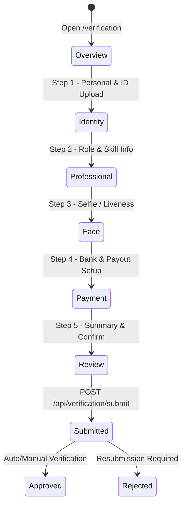

# Linkprosoft Verification Flow - API Specification & Endpoint Documentation

This document outlines the complete API architecture, data models, workflows, and endpoints required for the **Verification Flow** in Linkprosoft (`/verification`).

---

## 1. Overview & Verification Lifecycle

The verification flow validates user identities, professional credentials, biometric liveness, and payout banking details to establish trust across employers and professionals.

### Flow Steps & State Progression



### Verification Status Matrix
- `unverified`: User has not started verification.
- `in_progress`: User has submitted partial step data.
- `pending_review`: All steps submitted, awaiting automated provider check or admin review.
- `verified`: Verification approved; verified badge active.
- `rejected`: Verification declined; actionable feedback provided.

---

## 2. API Endpoints Summary

| Method | Endpoint | Description | Auth Required |
| :--- | :--- | :--- | :--- |
| `GET` | `/api/verification/status` | Get current user verification progress & status | Yes (Bearer Token) |
| `POST` | `/api/verification/identity` | Save personal data & upload identity document | Yes (Bearer Token, Multipart) |
| `POST` | `/api/verification/professional` | Save profession, experience, bio & skill categories | Yes (Bearer Token) |
| `POST` | `/api/verification/face` | Upload face selfie image / liveness verification | Yes (Bearer Token, Multipart) |
| `GET` | `/api/verification/banks` | Fetch supported commercial banks list | Yes (Bearer Token) |
| `POST` | `/api/verification/resolve-account` | Verify & resolve bank account name via NUBAN | Yes (Bearer Token) |
| `POST` | `/api/verification/payment` | Save payment bank details, BVN & transaction PIN | Yes (Bearer Token) |
| `POST` | `/api/verification/submit` | Final submission of the verification application | Yes (Bearer Token) |
| `GET` | `/api/verification/preview` | Get consolidated preview data across all steps | Yes (Bearer Token) |
| `GET` | `/api/admin/verifications` | (Admin) List all pending verification requests | Admin Only |
| `GET` | `/api/admin/verifications/:id` | (Admin) View details of a specific verification | Admin Only |
| `PATCH` | `/api/admin/verifications/:id/approve` | (Admin) Approve a user verification | Admin Only |
| `PATCH` | `/api/admin/verifications/:id/reject` | (Admin) Reject a user verification with reasons | Admin Only |

---

## 3. Detailed Endpoint Specifications

### 3.1. Get Verification Status
Fetches the overall status and individual progress per step for the authenticated user.

- **Method**: `GET`
- **Route**: `/api/verification/status` (or `/api/verification/me`)
- **Headers**:
  - `Authorization: Bearer <token>`
- **Response `200 OK`**:
```json
{
  "status": "success",
  "data": {
    "overallStatus": "in_progress", // "unverified" | "in_progress" | "pending_review" | "verified" | "rejected"
    "currentStep": 2,
    "completedSteps": ["identity"],
    "rejectionReason": null,
    "steps": {
      "identity": {
        "isCompleted": true,
        "submittedAt": "2026-08-30T09:15:00.000Z",
        "data": {
          "firstName": "Marvellous",
          "lastName": "Oluwaseun",
          "phone": "+2349066760056",
          "dateOfBirth": "2002-07-09",
          "address": "No 2 Aremu Olatunbosun",
          "nationality": "Nigerian",
          "idDocumentUrl": "https://storage.linkprosoft.com/ids/doc-123.jpg",
          "idType": "national_id"
        }
      },
      "professional": {
        "isCompleted": false,
        "data": null
      },
      "face": {
        "isCompleted": false,
        "data": null
      },
      "payment": {
        "isCompleted": false,
        "data": null
      }
    }
  }
}
```

---

### 3.2. Step 1: Submit Identity Verification
Saves the user's demographic info and uploads an identity document (National ID, Passport, Driver's License, Voter's Card).

- **Method**: `POST`
- **Route**: `/api/verification/identity`
- **Headers**:
  - `Authorization: Bearer <token>`
  - `Content-Type: multipart/form-data`
- **Form Data Payload**:
  - `firstName` (string, required): e.g. `"Marvellous"`
  - `lastName` (string, required): e.g. `"Oluwaseun"`
  - `phone` (string, required): e.g. `"+2349066760056"`
  - `dateOfBirth` (string / ISO Date, required): e.g. `"2002-07-09"`
  - `address` (string, required): e.g. `"No 2 Aremu Olatunbosun"`
  - `nationality` (string, required): e.g. `"Nigerian"`
  - `idType` (string, optional): `"national_id"` | `"nin"` | `"passport"` | `"drivers_license"` | `"voters_card"`
  - `idNumber` (string, optional): ID/NIN number
  - `idDocument` (file, binary, required): Image file (JPG, PNG) or PDF (Max 5MB)
- **Response `200 OK`**:
```json
{
  "status": "success",
  "message": "Identity verification details saved successfully",
  "data": {
    "step": "identity",
    "isCompleted": true,
    "idDocumentUrl": "https://storage.linkprosoft.com/ids/user-123-id.jpg",
    "nextStep": "professional"
  }
}
```

---

### 3.3. Step 2: Submit Professional Verification
Saves professional details, experience, overview bio, and skill categories.

- **Method**: `POST`
- **Route**: `/api/verification/professional`
- **Headers**:
  - `Authorization: Bearer <token>`
  - `Content-Type: application/json`
- **JSON Request Body**:
```json
{
  "profession": "Carpenter / Interior Woodworker",
  "yearsOfExperience": "5",
  "bio": "Experienced carpenter specializing in bespoke furniture and modern interior fittings.",
  "category": "Home Services",
  "selectedCategories": ["Home Services", "Design", "Tech", "Events"],
  "skills": ["Cabinet Making", "Furniture Assembly", "Wood Carving"]
}
```
- **Response `200 OK`**:
```json
{
  "status": "success",
  "message": "Professional verification details saved",
  "data": {
    "step": "professional",
    "isCompleted": true,
    "nextStep": "face"
  }
}
```

---

### 3.4. Step 3: Submit Face Verification (Selfie / Liveness)
Uploads the captured live selfie photo for facial match against the ID document.

- **Method**: `POST`
- **Route**: `/api/verification/face`
- **Headers**:
  - `Authorization: Bearer <token>`
  - `Content-Type: multipart/form-data`
- **Form Data Payload**:
  - `selfieImage` (file or base64 blob, required): Selfie photo image (JPG, PNG)
  - `livenessConfidence` (float, optional): Provider liveness score if pre-computed on client
- **Response `200 OK`**:
```json
{
  "status": "success",
  "message": "Face selfie uploaded and verified",
  "data": {
    "step": "face",
    "isCompleted": true,
    "selfieUrl": "https://storage.linkprosoft.com/selfies/user-123-selfie.jpg",
    "faceMatchScore": 0.96,
    "nextStep": "payment"
  }
}
```

---

### 3.5. Step 4 (Helper 1): Get Bank List
Returns the list of supported financial institutions for payout resolution.

- **Method**: `GET`
- **Route**: `/api/verification/banks` (or `/api/payments/banks`)
- **Headers**:
  - `Authorization: Bearer <token>`
- **Response `200 OK`**:
```json
{
  "status": "success",
  "data": [
    { "code": "044", "name": "Access Bank" },
    { "code": "058", "name": "Guaranty Trust Bank (GTB)" },
    { "code": "011", "name": "First Bank of Nigeria" },
    { "code": "033", "name": "United Bank for Africa (UBA)" },
    { "code": "057", "name": "Zenith Bank" },
    { "code": "999992", "name": "OPay Digital Services" },
    { "code": "999991", "name": "PalmPay" },
    { "code": "090110", "name": "Kuda Bank" }
  ]
}
```

---

### 3.6. Step 4 (Helper 2): Resolve Bank Account Name
Validates the account number against the selected bank to ensure funds are safely disbursed.

- **Method**: `POST`
- **Route**: `/api/verification/resolve-account`
- **Headers**:
  - `Authorization: Bearer <token>`
  - `Content-Type: application/json`
- **Request Body**:
```json
{
  "bankCode": "058",
  "accountNumber": "0123456789"
}
```
- **Response `200 OK`**:
```json
{
  "status": "success",
  "data": {
    "accountNumber": "0123456789",
    "accountName": "MARVELLOUS OLUWASEUN",
    "bankCode": "058",
    "bankName": "Guaranty Trust Bank"
  }
}
```

---

### 3.7. Step 4: Submit Payment Verification
Saves the confirmed bank account, payout settings, optional BVN, and sets up the user's transaction/payment password.

- **Method**: `POST`
- **Route**: `/api/verification/payment`
- **Headers**:
  - `Authorization: Bearer <token>`
  - `Content-Type: application/json`
- **Request Body**:
```json
{
  "bankName": "Guaranty Trust Bank",
  "bankCode": "058",
  "accountNumber": "0123456789",
  "account_name": "MARVELLOUS OLUWASEUN",
  "accountName": "MARVELLOUS OLUWASEUN",
  "paymentPassword": "secureTransactionPin123", // optional/set payment password
  "bvn": "22233344455" // optional BVN verification
}
```
- **Response `200 OK`**:
```json
{
  "status": "success",
  "message": "Payment verification details saved",
  "data": {
    "step": "payment",
    "isCompleted": true,
    "nextStep": "review"
  }
}
```

---

### 3.8. Step 5: Final Submission & Confirmation
Submits all gathered steps for final verification review and triggers automated checks or queue for admin approval.

- **Method**: `POST`
- **Route**: `/api/verification/submit`
- **Headers**:
  - `Authorization: Bearer <token>`
  - `Content-Type: application/json`
- **Request Body**:
```json
{
  "agreeToTerms": true
}
```
- **Response `200 OK`**:
```json
{
  "status": "success",
  "message": "Verification submitted successfully",
  "data": {
    "overallStatus": "pending_review", // or "verified" if automated verification completes immediately
    "submittedAt": "2026-08-30T10:45:00.000Z",
    "estimatedReviewTime": "12-24 hours"
  }
}
```

---

### 3.9. Admin Verification Endpoints (Backoffice / Operations)

#### List Pending Verifications
- **Method**: `GET`
- **Route**: `/api/admin/verifications?status=pending_review&page=1&limit=20`
- **Response `200 OK`**:
```json
{
  "status": "success",
  "data": {
    "total": 42,
    "page": 1,
    "items": [
      {
        "id": "verif_abc123",
        "userId": "user_xyz789",
        "userName": "Marvellous Oluwaseun",
        "role": "professional",
        "email": "marvellous@example.com",
        "submittedAt": "2026-08-30T10:45:00.000Z",
        "status": "pending_review"
      }
    ]
  }
}
```

#### Approve Verification
- **Method**: `PATCH`
- **Route**: `/api/admin/verifications/:id/approve`
- **Response `200 OK`**:
```json
{
  "status": "success",
  "message": "User verification approved",
  "data": {
    "verificationId": "verif_abc123",
    "userId": "user_xyz789",
    "status": "verified"
  }
}
```

#### Reject Verification
- **Method**: `PATCH`
- **Route**: `/api/admin/verifications/:id/reject`
- **Request Body**:
```json
{
  "rejectionReason": "Identity document image is blurry and unreadable. Please re-upload a clear scan.",
  "rejectedStep": "identity" // step that requires resubmission
}
```
- **Response `200 OK`**:
```json
{
  "status": "success",
  "message": "Verification rejected and notification sent to user",
  "data": {
    "verificationId": "verif_abc123",
    "status": "rejected"
  }
}
```

---

## 4. Frontend Integration Plan

### 4.1. Constant API Paths (`src/utils/apiPaths.js`)
Add the `VERIFICATION` group to `API_PATHS`:

```javascript
VERIFICATION: {
  STATUS: "/api/verification/status",
  GET_STATUS: "/api/verification/status",
  SUBMIT_IDENTITY: "/api/verification/identity",
  SUBMIT_PROFESSIONAL: "/api/verification/professional",
  SUBMIT_FACE: "/api/verification/face",
  BANKS: "/api/verification/banks",
  RESOLVE_ACCOUNT: "/api/verification/resolve-account",
  SUBMIT_PAYMENT: "/api/verification/payment",
  SUBMIT_ALL: "/api/verification/submit",
  PREVIEW: "/api/verification/preview",
  ADMIN: {
    LIST: "/api/admin/verifications",
    DETAILS: (id) => `/api/admin/verifications/${id}`,
    APPROVE: (id) => `/api/admin/verifications/${id}/approve`,
    REJECT: (id) => `/api/admin/verifications/${id}/reject`,
  }
}
```

### 4.2. Verification Service (`src/api/services/verificationService.js`)
Implement standard methods with `axiosInstance`:

```javascript
import axiosInstance from "../../utils/axiosInstance";
import { API_PATHS } from "../../utils/apiPaths";

const verificationService = {
  getStatus: async () => {
    const res = await axiosInstance.get(API_PATHS.VERIFICATION.STATUS);
    return res.data?.data || res.data;
  },

  submitIdentity: async (formData) => {
    const res = await axiosInstance.post(API_PATHS.VERIFICATION.SUBMIT_IDENTITY, formData, {
      headers: { "Content-Type": "multipart/form-data" },
    });
    return res.data?.data || res.data;
  },

  submitProfessional: async (payload) => {
    const res = await axiosInstance.post(API_PATHS.VERIFICATION.SUBMIT_PROFESSIONAL, payload);
    return res.data?.data || res.data;
  },

  submitFace: async (formData) => {
    const res = await axiosInstance.post(API_PATHS.VERIFICATION.SUBMIT_FACE, formData, {
      headers: { "Content-Type": "multipart/form-data" },
    });
    return res.data?.data || res.data;
  },

  getBanks: async () => {
    const res = await axiosInstance.get(API_PATHS.VERIFICATION.BANKS);
    return res.data?.data || res.data;
  },

  resolveAccount: async (bankCode, accountNumber) => {
    const res = await axiosInstance.post(API_PATHS.VERIFICATION.RESOLVE_ACCOUNT, {
      bankCode,
      accountNumber,
    });
    return res.data?.data || res.data;
  },

  submitPayment: async (payload) => {
    const res = await axiosInstance.post(API_PATHS.VERIFICATION.SUBMIT_PAYMENT, payload);
    return res.data?.data || res.data;
  },

  submitVerification: async (payload = { agreeToTerms: true }) => {
    const res = await axiosInstance.post(API_PATHS.VERIFICATION.SUBMIT_ALL, payload);
    return res.data?.data || res.data;
  },
};

export default verificationService;
```

---

## 5. Security & Validation Rules

1. **Authentication**: All endpoints require an active JWT session (`Bearer <token>`).
2. **File Restrictions**:
   - Identity & Face images restricted to `image/jpeg`, `image/png`, `image/webp`, and `application/pdf` (for ID only).
   - Maximum upload size: 5MB per image.
3. **Data Sanitization & Encryption**:
   - BVN and payment passwords must be transmitted over TLS and never logged in plain text.
   - PII (Date of Birth, National ID numbers) stored in compliance with NDPR / GDPR regulations.
4. **State Machine Integrity**:
   - The user cannot call `/api/verification/submit` before completing identity, face, and payment steps.
